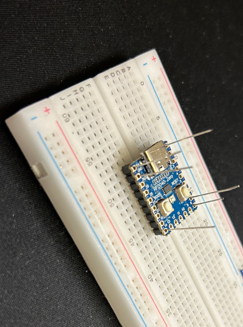
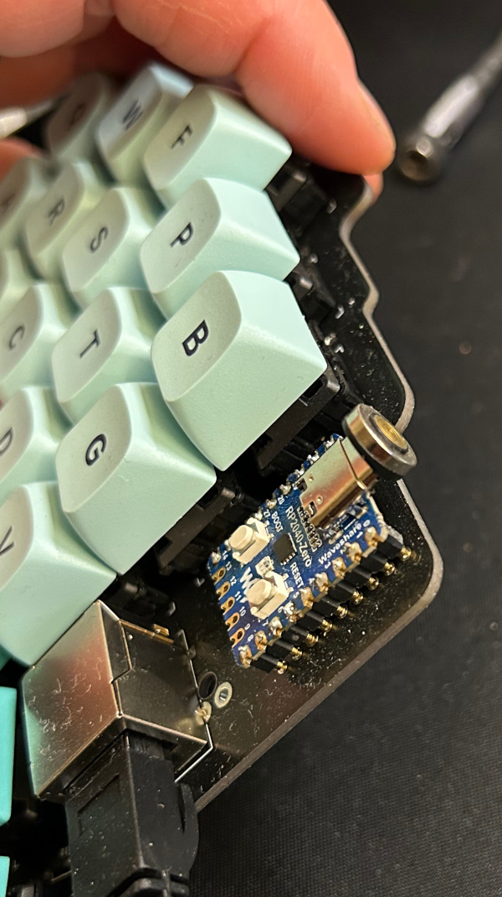
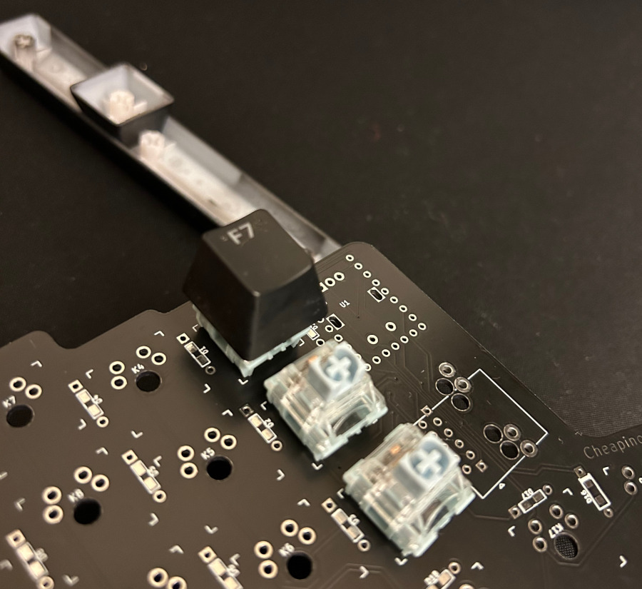
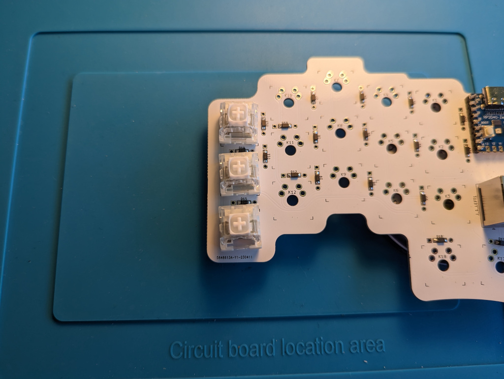
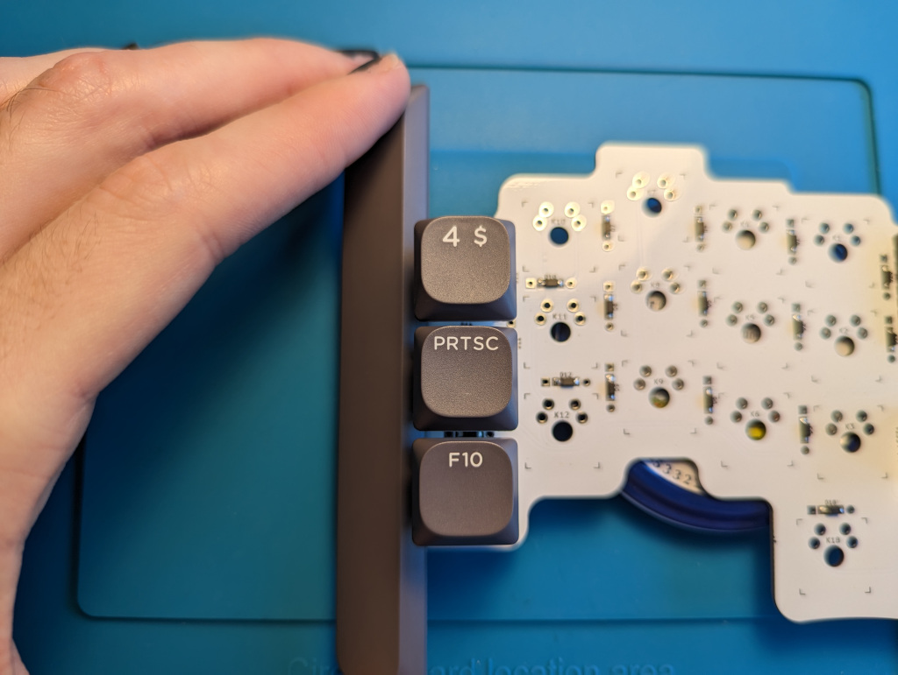
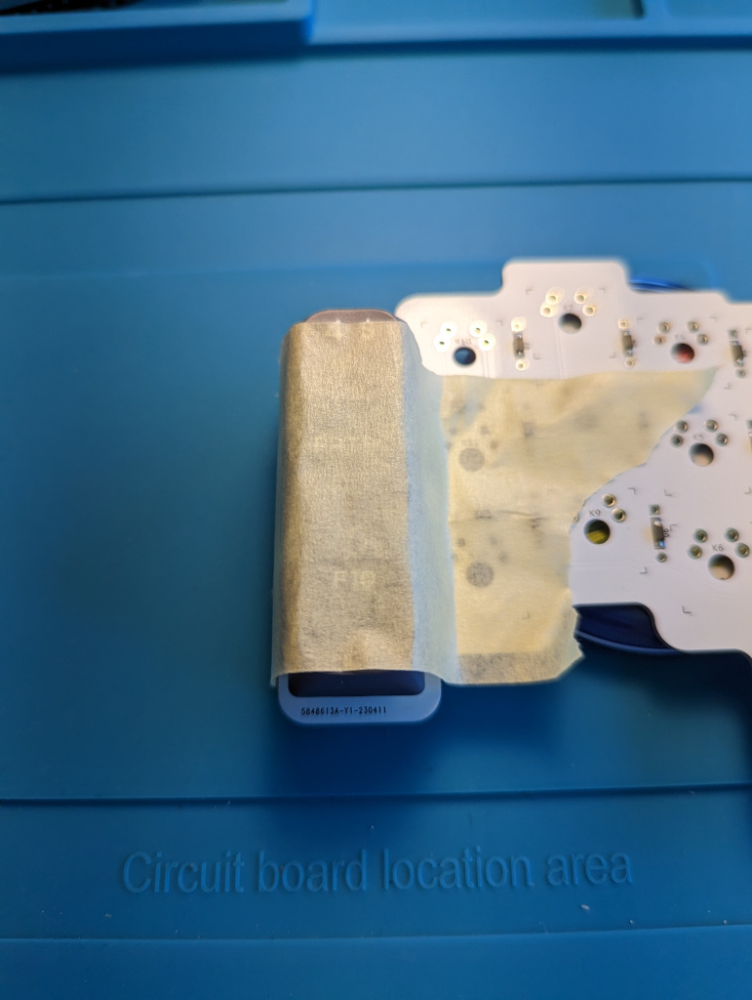
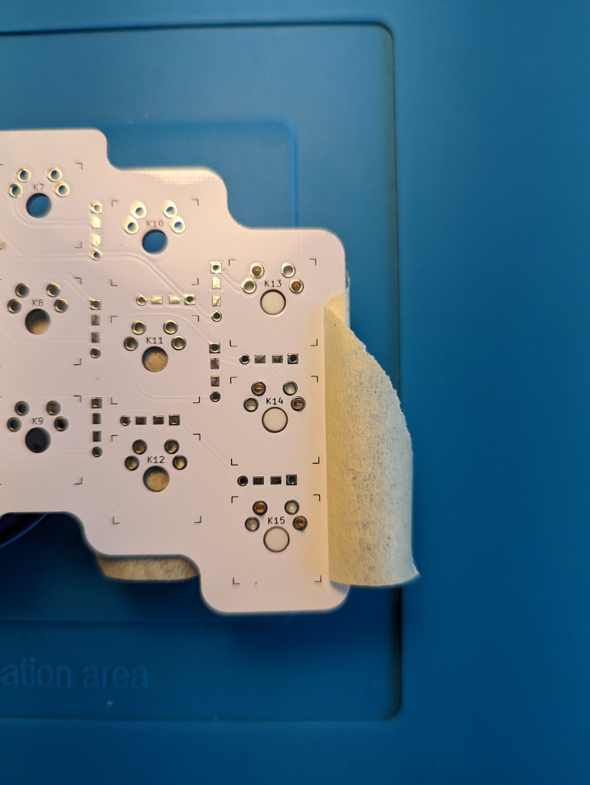
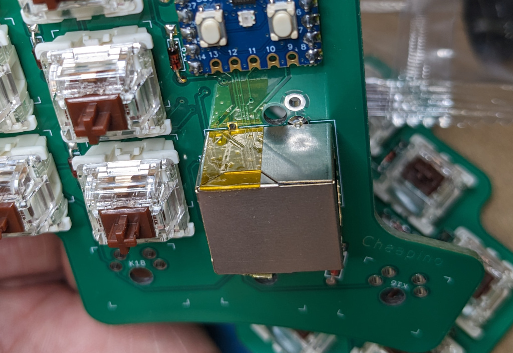
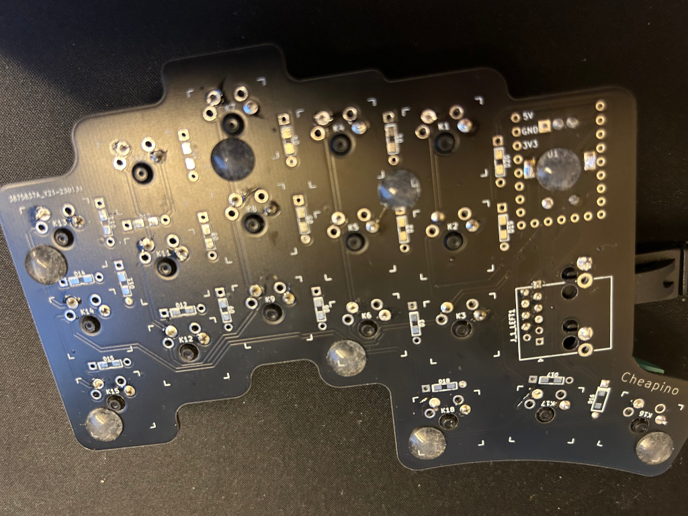

# Cheapino v1 build guide

## Introduction

Welcome to the Cheapino Keyboard Build Guide! In this guide, we will walk you through the steps to build your own custom keyboard using the Cheapino kit. The Cheapino is a budget-friendly DIY split mechanical keyboard that is perfect for beginners who are looking to try their hand at building their own keyboard.

## Tools

Before we start, here are the tools you will need:

- Soldering iron
- Solder
- Diagonal cutters

## Parts

Since the PCBs are the most expensive items, and you cant order less than 5 from most sites, Im assuming you will build 2 Cheapinos. Most of the other components will also come in quantities allowing for 2 sets.

Im not including switches and keycaps, since these are a matter of personal taste.
You will need 36 switches and 1u(the regular letter sized) keycaps per set.
This can easily be the most expensive 

| Part         | Quantity | Where to get it | Estimated price (including shipping) |
| ------------ | -------- | --------------- | --------------- |
| Cheapino PCB |        4 | Upload the [PCB v1 gerber](https://github.com/tompi/cheapino/releases/download/v1.0/gerber.zip) to [JLCPCB](https://www.jlcpcb.com) (or other pcb house). | 20.00 (for 5 pcs) |
| Waveshare RP2040-Zero |  2 | [AliExpress](https://www.aliexpress.com/item/3256804781611696.html) | 8.50 (for 2 pcs) |
| RJ45 Socket |  4 | [AliExpress](https://www.aliexpress.com/item/32902228456.html) | 5.00 (for 10 pcs)|
| EC11 Rotary encoder |  2 | [AliExpress](https://www.aliexpress.com/item/10000000931574.html) | 5.00 (for 2 pcs) |
| Encoder knob |  2 | [AliExpress](https://www.aliexpress.com/item/32749281108.html) | 5.00 (for 2 pcs)|
| Diodes 1N4148 | 80 | [AliExpress](https://www.aliexpress.com/item/32660088529.html) | 2.00 (for 100 pcs) |

These parts are optional, but nice to have:

| Part         | Quantity | Where to get it | Estimated price (including shipping) |
| ------------ | -------- | --------------- | --------------- |
| Sockets for MCU(optional) |  2 | [AliExpress](https://www.aliexpress.com/item/32892386779.html) | 5.00 (for 10 pcs) |
| Flexible RJ45 cable 0.5m |  2 | [AliExpress](https://www.aliexpress.com/item/1005002518783703.html) | 3.00 (for 2 pcs) |
| Magnetic USB cable |  2 | [AliExpress](https://www.aliexpress.com/item/1005003776565766.html) | 3.00 (for 2 pcs) |
| Rubber bumpers | ~16 | [AliExpress](https://www.aliexpress.com/item/1005003044229837.html) | 2.00 (for 50 pcs) |

## Steps

In my experience it is easiest to solder the lowest components first, and the highest last, since you need to turn the PCB around with the components on the other side when soldering(and then you want the loose ones to rest directly at the desk). Thats why I suggest starting with the diodes, then the MCU, the switches, the RJ45 socket and lastly the encoder.

### Step 1: Diodes

You need to be careful to solder the diodes the correct way. The line on the diode should always be closest to the square pad of the footprint, NOT the round one. The PCB supports SMD and throug hole diodes, but since K16 is missing smd pads, I recommend using through hole(if you only have smd, you need to hack K16, not very hard, use a small piece of wire).

If you use through hole diodes and have sockets for the MCU, keep the legs you cut off and use them for socketing the MCU.

### Step 2: MCU

Only the pins on the 2 long sides are actually used, but if you have the RP2040-Zero with pre-soldered pin headers, there is room for that also. Choose one of the following steps:

#### Socket the MCU

Socketing makes it easier to reuse the MCU(the RP2040-Zero) for another build later, or swap it if its broken or malfunctions. 

If you have sockets for the MCU, mount them on a breadboard, or stick them in some cardboard to get them straight when mounting.

Stick the clipped diode feet through the MCU, and down into the socket. Use a tool, or you will stick it into your fingers(been there, done that...). 

Solder all the feet in place, and remove all 3 parts from the breadboard, and put them into the PCB, use some tape to hold it in place when you turn it around and solder it.

#### Use pinheader to mount MCU

Use the two longest yellow pin headers that come with the MCU: solder them to the board first, and then solder the MCU to them.

### Step 3: Install the Switches

Next, it's time to install the switches. 
This can be a bit tricky to get straight, since there is only 3 pin holes.
Try to solder one column at a time, use something to align the switches, and tape them down before soldering.

One trick from [TentacleSenpai69](https://www.reddit.com/user/TentacleSenpai69/) is to put on keycaps on a column and use a space bar to keep the column aligned, and then tape it.

If you have a 3D printer you could print these excellent fork-helpers from @MrBarbie: https://www.printables.com/model/582030-switch-alignment-rail
Make sure you print the 19mm version, since the cheapino uses 19.00 mm spacing instead of the traditional 19.05 mm spacing...

### Step 4: Install the RJ45 sockets

Some connectors might short the casing to the outer unused pin.
It might be a good idea to place a tiny piece of tape on top
of the pin hole that is directly on the footprint outline of the connector you are installing, or at the housing itself where it touches this.

Just align them to the white outline. They should stay in place by themselves when you flip the PCB to solder them.

### Step 5: Install the encoder

Put the encoder in the footprint on the right side, make sure its flush to the PCB when you solder it.

### Step 6: Trim below and install bumpers

Use the cutters to trim any extruding wires on the underside of the PCBs. Maybe clip them inside a plastic bag to prevent the metal from flying around. Install rubber bumpers to protect your desk and keep the keyboard from moving.

## Firmware

Congratulations, you have successfully built your own custom keyboard.

See the [firmware guide](firmware.md) for how to build and customize keyboard firmware.

Send me a mail or issue if something doesnt work as expected!

