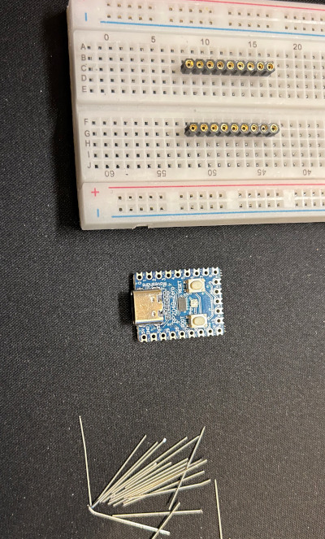

# Cheapino v2 build guide

## Introduction

Welcome to the Cheapino Keyboard v2 Build Guide!
In this guide, I will walk you through the steps to build your own custom keyboard using the Cheapino v2 kit.
The Cheapino is a budget-friendly DIY split mechanical keyboard that is perfect for beginners who are looking 
to try their hand at building their own keyboard.

I assume you read the [ordering guide](orderingguide.md) and have all the mandatory parts and tools.

## Steps

In my experience it is easiest to solder the lowest components first, and the highest last, since you need to turn the PCB around with the components on the other side when soldering(and then you want the loose ones to rest directly at the desk). Thats why I suggest starting with the diodes, then the MCU, the switches, the RJ45 socket and lastly the encoder.

### Step 1: Diodes

You need to be careful to solder the diodes the correct way. The line on the diode should always be closest to the square pad of the footprint, NOT the round one. The PCB supports SMD and throug hole diodes, and you can choose which side you want to mount them. I suggest mounting them on the top side, to keep height of board as low as possible. 

[Diodes](images/buildguidev2/diodes.png)

If you use through hole diodes and have sockets for the MCU, keep the legs you cut off and use them for socketing the MCU.

[Diode legs](images/buildguidev2/diodes_legs.png)

### Step 2: MCU

Only the pins on the 2 long sides are actually used, but if you have the RP2040-Zero with pre-soldered pin headers, there is room for that also. Choose one of the following steps:

#### Socket the MCU

Socketing makes it easier to reuse the MCU(the RP2040-Zero) for another build later, or swap it if its broken or malfunctions. 

If you have sockets for the MCU, mount them on a breadboard, or stick them in some cardboard to get them straight when mounting.

Stick the clipped diode feet through the MCU, and down into the socket. Use a tool, or you will stick it into your fingers(been there, done that...). 

Solder all the feet in place, and remove all 3 parts from the breadboard, and put them into the PCB, use some tape to hold it in place when you turn it around and solder it.

(I know I know, the image is of the v1 PCB, but MCU install is exactly the same...)

#### Use pinheader to mount MCU

Use the two longest yellow pin headers that come with the MCU: solder them to the board first, and then solder the MCU to them.

### Step 3: Install the Switches

Next, it's time to install the switches. 
If you only have 3 pin switches, refer to hints in the v1 build guide on how to align them.

Pop them all in, turn the PCB around and solder them.
I solder 1 pin from each switch on a row, and then do the other pin for the entire row, to
minimize risk of overheating switch and melting the plastic.

### Step 4: Install the RJ45 sockets

Just align them to the white outline. They should stay in place by themselves when you flip the PCB to solder them.

### Step 5: Install the encoder

Put the encoder in the footprint on the right side, make sure its flush to the PCB when you solder it.

### Step 6: Trim below and install bumpers

Use the cutters to trim any extruding wires on the underside of the PCBs. 
I havent done this with anything else than the encoder pins which I found to
stick out a little extra.

Maybe clip them inside a plastic bag to prevent the metal from flying around. 

Install rubber bumpers to protect your desk and keep the keyboard from moving.
The v2 outline is a bit smaller than the v1, so be generous with the bumpers,
sprinkle them all around, or typing will be wobbly.

### Step 7: Test that everything works.

There is a good chance you forgot to solder a diode or a switch leg...

Flash the vial firmware in the release section.
The encoder should send arrow up and down by default, and pressing
the encoder should play/pause your currently playing media.

Download vial to test all the keys(and use it to re-map if you want).

## Firmware

Congratulations, you have successfully built your own custom keyboard.

See the [firmware guide](firmware.md) for how to build and customize keyboard firmware.

Send me a mail or issue if something doesnt work as expected!

