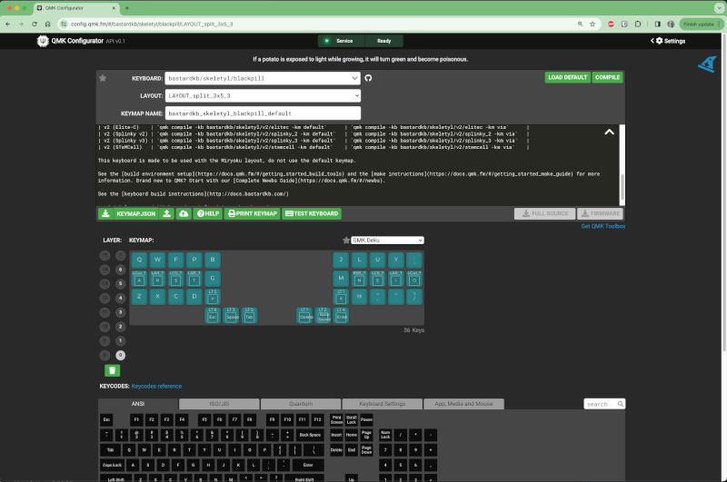

Firmware guide
==============

The release section contains pre-built firmware for Vial, a minimal qwerty build
and miryoku with either qwerty or colemak.

There are 2 main routes to tweak your own keymap, either flash the vial firmware and use the vial web or desktop ui
to configure the keyboard, or setup qmk for compiling locally.

In either case, there are A LOT of options to tweak...
Check out the links at the bottom for further reference.

# Configuring using vial

This is the easiest way of setting up your keyboard:

1. Download cheapino_vial.uf2 file for your release([v2 is here](https://github.com/tompi/cheapino/releases/download/v2.0/cheapino_vial.uf2))
2. Put your rp2040-zero in dfu mode by holding boot button while you plug in usb c
3. The rp2040-zero should show up as a usb drive
4. Drag and drop uf2 file to the usb drive that popped up after 2.
5. The rp2040 will now reboot really fast, so you might get an error message, even though it went well
6. Surf to https://vial.rocks/ and start configuring
7. OR, if you want a local tool: ownload vial from here: https://get.vial.today/download/

All keys and encoder actions should be configurable in the Vial program while
your keyboard is configured. There is also loads of parameters to tweak for optimal performance
for your style...


# Setting up and compiling qmk

For most flexibility, you want to compile the qmk firmware yourself.

Unfortunately, the cheapino firmware is not merged into the official qmk repository,
so there are a few extra steps to setting up qmk for compiling cheapino.
This is the recipe for windows(for mac/linux, install qmk the recommended way and jump to step 3):

1. Install qmk msys from https://msys.qmk.fm/
2. Inside qmk msys, type qmk setup - this will create a qmk_firmware folder that has cloned the main branch of qmk from git.
3. Run this command(make sure you are in the "qmk_firmware"folder) to add a reference to the cheapino qmk fork:
```sh
git remote add tompi https://github.com/tompi/qmk_firmware
```
4. Run this command to actually fetch the code(replace "cheapinov2" with "cheapino" if you are using cheapino v1 pcbs):
```sh
git fetch tompi cheapinov2
```
5. Run this command to switch local files to the cheapino variant(again, replace "cheapinov2" with "cheapino" if using v1 pcbs):
```sh
git checkout tompi/cheapinov2
```
6.Now you should be able to make and flash with:
```sh
qmk flash -kb cheapino -km default
```
7. When qmk says "Waiting for drive to deploy", hold boot btn while pressing reset on the rp2040, which should put it in dfu mode, and qmk will then flash.

To make your own version and customize it:

1. Copy the "keyboards/cheapino/keymaps/default/" folder to "keyboards/cheapino/keymaps/thebestkeymap/".
2. Upload the file keymap.json (that you copied) to https://config.qmk.fm/
3. Go wild with configuring up to 15 layers...
4. Press the download button.
5. Move the downloaded json file to "keyboards/cheapino/keymaps/thebestkeymap/keymap.json"
6. Build and flash the keymap with:
```sh
qmk flash -kb cheapino -km thebestkeymap
```
7. When qmk says "Waiting for drive to deploy", hold boot btn while pressing reset on the rp2040, which should put it in dfu mode, and qmk will then flash.

(and you guessed it, you can choose to call it something else than thebestkeymap)



To help learn your keymap, @omark96 made this tool that works on windows: https://github.com/omark96/qmk_keymap_overlay

## Encoder customization

Tweaking the encoder actions is supported in vial, but needs to be done in the keyboards/cheapino/encoder.c file for local qmk build, they are not part of the keymap.
(you dont HAVE to be a progammer to change it, but you may call yourself a novice programmer once you do...)
In the method called "turned", there are actions defined for multiple layers, this one is tweaked for my personal layer...
The "else" section at line 26, will send page down for clockwise encoder turns, and page down for counter clockwise.
The first if, line 20, sends volume up/down if you are on layer 6. 

The encoder push is defined to media pause/play in the "clicked" method on line 15.
Feel free to remap it to different keys depending on layers, like the turns are done.
TBH, I dont really use the encoder much, so I didnt spend much time tweaking this...

Once you change the encoder file, run the command from step 6 and 7 to deploy changes to your keyboard.

# Build your own Miryoku

There is a branch of miryoku you can use for local builds here:
https://github.com/tompi/qmk_firmware/tree/cheapinov2-miryoku

You need to build this with the miryoku keymap, so somethin like this:
```sh
qmk flash -kb cheapino -km manna-harbour_miryoku
```

To build with different layouts, follow the docs here(you can skip to the build section if you use my branch):
https://github.com/manna-harbour/miryoku_qmk/tree/miryoku/users/manna-harbour_miryoku


# Miryoku with vial

@glennmca used VIAL to build a Miryoku layout, documented here:
https://gist.github.com/glennmca-dev/ddddcafe46dd1e2e36ed853bf55077e3

# Compile QMK with docker

I did not try this, but seems way easier than mucking about with installing a trillion dev-dependencies:
https://github.com/qmk/qmk_firmware/blob/master/docs/getting_started_docker.md

# References for keymaps and qmk tweaking

* Miryoku is a very well thought out layout: https://github.com/manna-harbour/miryoku
* @gtreuer has a lot of tricks up his sleeve: https://getreuer.info/posts/keyboards/tour/index.html
* Some inspiration for making your own keymap: https://keymapdb.com/
* Check out colemak-dh if you are curious about other layouts than qwerty: https://colemakmods.github.io/mod-dh/
* For practicing, https://www.keybr.com/ and https://monkeytype.com/ are nice
* If you are on reddit, you should join https://www.reddit.com/r/ErgoMechKeyboards/

Good luck!
